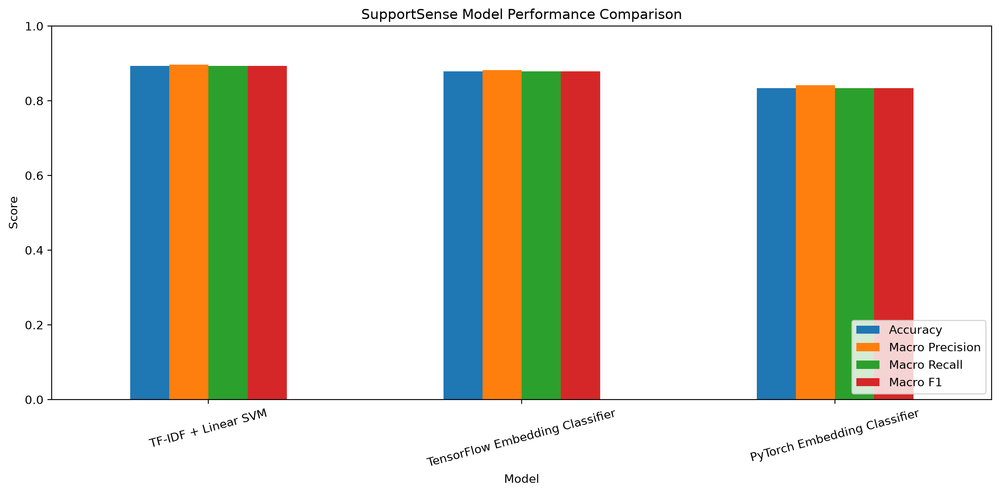
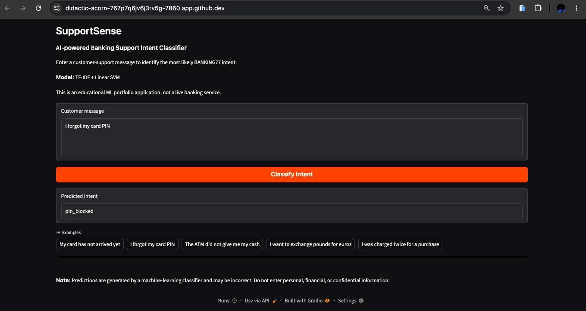

# SupportSense — Banking Customer Support Intent Classification

An end-to-end machine-learning project that classifies banking customer-support messages into 77 intent categories using the BANKING77 dataset.

The project covers exploratory data analysis, SQL data storage, text preprocessing, classical machine learning, neural-network experimentation, model evaluation, automated testing, and an interactive Gradio application.

## Live Demo

Try the deployed SupportSense application:

**[Launch SupportSense]https://supportsense-ml.onrender.com/**

> Hosted on Render's free tier. The application may take
> a short time to start after a period of inactivity.

## Project Overview

Customer-support teams receive messages about card deliveries, payments, cash withdrawals, account access, transfers, and other banking issues.

SupportSense investigates whether machine learning can identify the intent of these messages to support potential downstream tasks such as ticket categorisation and routing.

The application accepts a customer message and predicts its most likely BANKING77 intent.

**This is a portfolio demonstration, not a production banking system.**

## Technologies

- **Language:** Python
- **Data analysis:** Pandas, NumPy, Matplotlib
- **Database:** PostgreSQL
- **Classical ML:** scikit-learn, TF-IDF, Linear SVM
- **Deep learning:** PyTorch, TensorFlow/Keras
- **Evaluation:** Accuracy, Macro Precision, Macro Recall, Macro F1, per-class metrics, confusion analysis
- **Application:** Gradio
- **Testing:** pytest
- **Development:** Git, GitHub, GitHub Codespaces, Jupyter notebooks

## Dataset

This project uses **BANKING77**, a banking customer-support intent classification dataset.

- **77 intent categories**
- **10,003 official training examples**
- **3,080 official test examples**

The official training data was split into training and validation subsets for model development and hyperparameter selection.

The official test set was reserved for final evaluation after model selection within each modelling approach.

## Machine-Learning Approaches

Three approaches were implemented and evaluated:

1. **TF-IDF + Linear SVM:** A classical text-classification baseline using sparse text features.
2. **PyTorch embedding classifier:** A neural network with trainable embeddings, masked mean pooling, dropout, and a classification layer.
3. **TensorFlow/Keras embedding classifier:** A comparable neural architecture implemented with Keras.

## Model Performance

| Model | Accuracy | Macro Precision | Macro Recall | Macro F1 |
|---|---:|---:|---:|---:|
| TF-IDF + Linear SVM | [0.893182] | [0.896669] | [0.893182] | [0.893366] |
| PyTorch classifier | [0.833117] | [0.841465] | [0.833117] | [0.833511] |
| TensorFlow classifier | [0.878571] | [0.882483] | [0.878571] | [0.878492] |



### Selected Model

**TF-IDF + Linear SVM** was selected as the initial application model.

The selection considered official test performance alongside preprocessing complexity, artifact size, inference requirements, and maintainability.

**Specific rationale:** [The TF-IDF + Linear SVM was selected **as the production model because it achieved the highest test performance, with 89.32% accuracy and 89.34% macro F1, compared with 87.86% / 87.85% for TensorFlow/Keras and 83.31% / 83.35% for PyTorch. Its precision (89.67%) and recall (89.32%) were also well balanced. Given that the neural-network approaches introduced greater implementation complexity without improving performance, TF-IDF + Linear SVM provided the strongest balance of performance, simplicity, and practical deployability**.

The decision considered both predictive performance and engineering
trade-offs, including preprocessing requirements, model complexity,
artifact size, inference workflow, and maintainability.]

## Application

SupportSense includes a Gradio interface where users can:

- Enter a banking-support message.
- Request an intent prediction.
- View the predicted intent label.
- Try example customer messages.

The application uses the saved scikit-learn pipeline without retraining it.

### Application Screenshot



## Running Locally

### 1. Clone the repository

```bash
git clone 'https://github.com/DarkL19ht/supportsense-ml.git'
cd supportsense-ml
```

### 2. Create and activate a virtual environment

```bash
python -m venv .venv
source .venv/bin/activate
```

On Windows PowerShell:

```powershell
.venv\Scripts\Activate.ps1
```

### 3. Install dependencies

```bash
python -m pip install -r requirements.txt
```

### 4. Start the application

```bash
python app.py
```

Open the URL displayed by Gradio.

**Model requirement:** The trained `models/supportsense_sklearn.joblib` artifact must be present. If it is not included in the repository, download it using the documented artifact instructions.

### 5. Run automated tests

```bash
python -m pytest -v
```

## Project Structure

```text
supportsense-ml/
├── app.py
├── data/
├── docs/
├── models/
├── notebooks/
├── reports/
├── src/
├── tests/
└── requirements.txt
```

- `app.py` — Gradio user interface
- `src/` — Reusable data, model, database, and evaluation code
- `notebooks/` — Analysis, experimentation, and model comparison
- `models/` — Saved model artifacts and metadata
- `reports/` — Evaluation metrics, predictions, and figures
- `tests/` — Automated tests
- `docs/` — Architecture and additional documentation

## Limitations

- The model is trained on English banking-support queries from BANKING77.
- Predictions may be incorrect for ambiguous, unfamiliar, or out-of-domain messages.
- Intent classification does not constitute financial advice or automated resolution of customer problems.
- The Linear SVM's raw decision scores are not calibrated probabilities.
- No real customer banking information should be submitted to the demonstration application.

## Future Improvements

- Evaluate out-of-domain and ambiguous messages.
- Investigate probability calibration or a reliable abstention mechanism.
- Add inference latency benchmarks and monitoring.
- Containerise the application and develop a deployment pipeline.
- Evaluate additional text representations and contextual language models.

## Project Status

**Completed and publicly deployed.**

- BANKING77 dataset exploration and PostgreSQL integration
- TF-IDF + Linear SVM, PyTorch and TensorFlow model development
- Model evaluation, comparison and selection
- Gradio application with reusable inference logic
- Automated pytest testing
- Public deployment on Render

