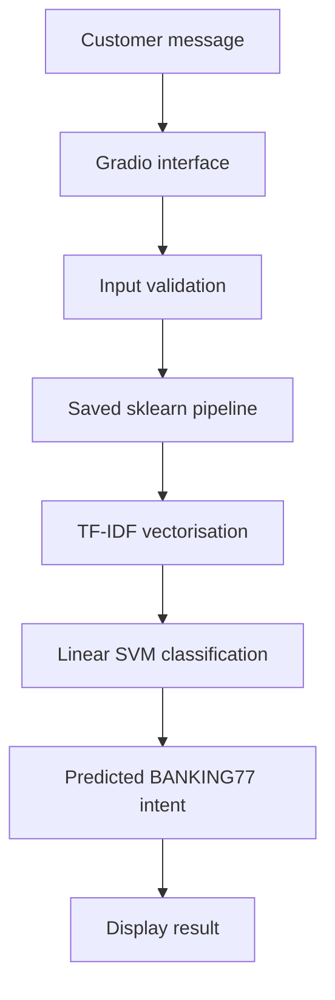
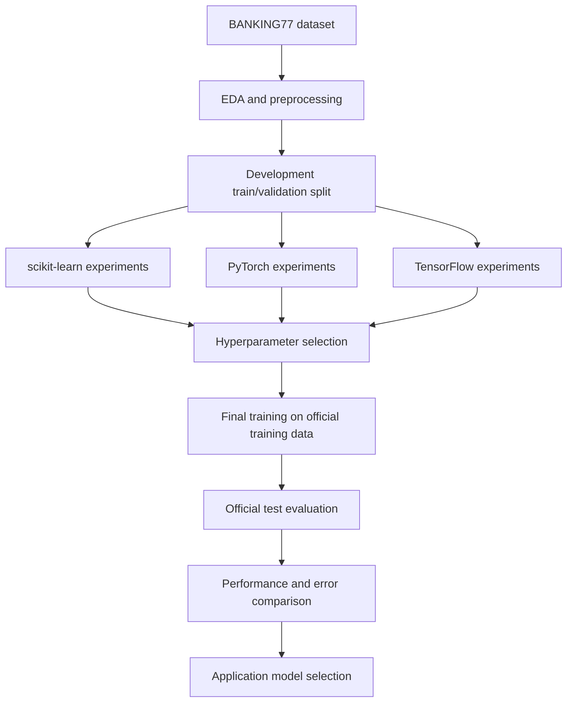

# SupportSense — System Architecture

## 1. System Overview

SupportSense is a Python-based machine-learning application for banking customer-support intent classification.

The project separates experimentation, model artifacts, reusable prediction logic, and the user interface.

## 2. Application Inference Flow

## 3. Model Development Flow

## 4. Selected Model

The application uses a saved TF-IDF + Linear SVM pipeline.

The model is loaded once when the Gradio application starts, and the same loaded model is reused for subsequent predictions.

The prediction module is separated from the user interface to allow independent testing and future reuse.

## 5. Components

| Component | Responsibility |
|---|---|
| `app.py` | Gradio interface and user interactions |
| `src/models/app_predict.py` | Model loading, input validation, prediction |
| `models/supportsense_sklearn.joblib` | Trained classification pipeline |
| `notebooks/` | Exploration, model development, and comparison |
| `reports/` | Evaluation metrics and error analysis |
| `tests/` | Automated verification |

## 6. Limitations

The application does not implement user authentication, production monitoring, automated model updates, or a banking-system integration.

The classifier produces intent labels, not verified answers or banking actions.